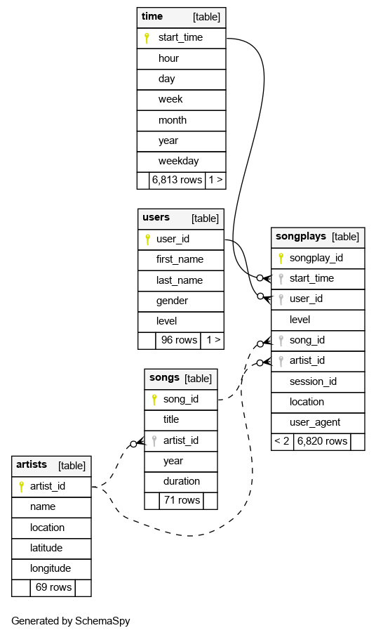

# Sparkify analytics database

## Goals

The goal of the database is to have all data about listened songs easily accessible for 
analysis. This is crucial for the startup in order to understand the customer behaviour 
and preferences. 

For example, for the startup it is important to know which songs/artists are played a lot, how many paid 
users exists, how the ratio between free and paid users develops, etc. etc.

## Database schema design and etl process

#### The database is set up in a star schema:
- The fact table `songplays` has an entry for each played song. In addition to 
  basic information like the `timestamp` each entry has the `id` of the corresponding 
  user, song and artist which links to the corresponding dimension table.
- The central `songplays` table links to the following dimension tables:
    - `users` table has information about the users
    - `songs` table has information about the songs
    - `artists` table has information about the artists
    - `time` table has additional information about the time when the songs were played.
  


This database design is very useful for analytics as it simplifies analytics queries a lot
and allows fast aggregations. In the case of Sparkify the relevant entity is the 
songplay, which is stored in the songplays table. Aggregations (e.g. how many songs were played
per day) can be performed very easily. If additional information are needed e.g. for grouping of filtering 
of the played songs, they are readily available in the dimension tables.

#### The ETL process consists of the following steps:
- Processing of song_data
  - Loading of song_data one file at a time, one file has one entry
  - Extracting of song information from the song_data and saving the `songs` dimension table
  - Extracting of artist information from the song_data and saving the `artists` dimension table
- Processing of log_data (played songs)
  - Loading of log_data one file at a time, one file has usually multiple entries
  - Extracting of the timestamp column, calculating metadata for each timestamp and save to the `time` dimension table
  - Extracting of users information from the log_data and saving the `users` dimension table
  - For each song:
    - Query database for artist_id and song_id of the played song
    - Extracting of songplay information from the log_data and combine with artist_id and song_id (`None` if nothing was found)
    - Saving songplay information to database

#### Remarks to SQL queries

A primary key column was added to each table. In case of the songplays table the `songplay_id` column 
was also marked as `SERIAL` to auto generate new ids as entries are inserted into the table.
The primary key together with the suffix `ON CONFLICT DO NOTHING` in the `INSERT` statement of
the fact tables was very useful to remove duplicate entries.

In case of the users table duplicate entries would be common as a user has usually a lot
of songplays and without duplicate removal one entry in the users table per songplay would be made.
For some reason there is also one duplicate in the song_date (artist Clp with id `ARNTLGG11E2835DDB9` is included twice).

#### Missing features

- Foreign key relationships between the primary keys of dimensional tables and the 
  columns in the fact table are missing in some cases (songs and artists tables) as entries in
  these tables are missing for many songplays. 

- Indices on the id-columns in the fact table for faster querying.
  

#### Example queries

- Number of songs played each day:
```sql
SELECT DATE(start_time) as date, COUNT(*) as cnt_songplays_per_day
FROM songplays
GROUP BY DATE(start_time)
ORDER BY DATE(start_time)
```
- Ratio between free and paid songplays:
```sql
SELECT level, COUNT(*) * 1.0 / (SELECT COUNT(*) FROM songplays) AS frequency
FROM songplays
GROUP BY level
```
- Distribution of songplays between the weekdays:
```sql
SELECT time.weekday, COUNT(*) as cnt_songplays_per_day
FROM songplays
JOIN time USING (start_time)
GROUP BY time.weekday
ORDER BY time.weekday
```

#### Local development with docker

A docker container was used for local development. For this a small docker-compose.yml file was written:
```dockerfile
version: '3.7'
services:
  postgres:
    image: postgres
    restart: always
    ports:
      - 5432:5432
    environment:
      POSTGRES_USER: student
      POSTGRES_PASSWORD: student
      POSTGRES_DB: studentdb
```
